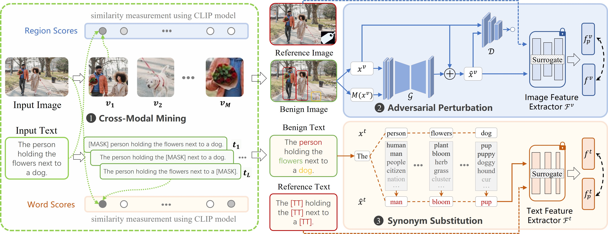

# BadCM
> Offical implementation for the work "BadCM: Invisible Backdoor Attack against Cross-Modal Learning".

<center>

</center>


**The full code is in processing, coming soon ...**

## Setup

### Installation 

```shell
git clone https://github.com/xandery-geek/BadCM.git
cd BadCM
pip install -r requirements.txt
```

### Build Third Part Packages

```shell
mkdir third_party
cd third_party
```

build detection
> We use pretrained [grid-feats-vqa](https://github.com/facebookresearch/grid-feats-vqa) for object detection.

```shell
mkdir detection
cd detection
git clone https://github.com/facebookresearch/grid-feats-vqa.git
python -m pip install 'git+https://github.com/facebookresearch/detectron2.git@ffff8ac'

mkdir weights
wget -P weights https://dl.fbaipublicfiles.com/grid-feats-vqa/X-152/X-152.pth
wget -P weights https://raw.githubusercontent.com/SRI-CSL/TrinityMultimodalTrojAI/main/data/annotation_map.json
cd ..
```

build ViLT
> We use pretrained [ViLT](https://github.com/dandelin/ViLT) for extraction of modality-invariant components.

```
git clone https://github.com/dandelin/ViLT.git
mv ViLT vilt

# download pretrained weights for ViLT
mkdir vilt/weights
wget -P vilt/weights https://github.com/dandelin/ViLT/releases/download/200k/vilt_irtr_coco.ckpt

cd ../..
```

## Dataset Preparation
NUS-WIDE, MS-COCO and IAPR-TC are the most widely used databases for the evaluation of crossmodal retrieval. For each dataset, we split it into three parts: training set, test (query) set, and retrieval set, as shown in the following table.

|Dataset|Modality|$N$|$N_{train}/N_{test}$|$C$|
|-|-|-|-|-|
|NUS-WIDE|Image/Tag|190,421|10,500/2,100|21|
|MS-COCO|Image/Short Sentence|123,287|10,000/5,000|80|
|IAPR-TC|Image/Long Sentence|20,000|10,000/2,000|255|

The partitioned dataset can be downloaded from [here](https://github.com/xandery-geek/BadCM/releases/tag/dataset). Note that we do not offer the original images, you can access them from the official website of each dataset.

The dataset directory is organized as follows:
```shell
../data
├── MS-COCO
│   ├── train2014/
│   ├── val2014/
│   ├── cm_database_imgs.txt
│   ├── cm_database_labels.txt
│   ├── cm_database_txts.txt
│   ├── cm_test_imgs.txt
│   ├── cm_test_labels.txt
│   ├── cm_test_txts.txt
│   ├── cm_train_imgs.txt
│   ├── cm_train_labels.txt
│   └── cm_train_txts.txt
├── IAPR-TC
│   ...
└── NUS-WIDE
    ...
```

## Modality-invariant Components Extraction

For visual modality
```shell
# extract regions by object detector
python -m badcm.regions_extractor --dataset NUS-WIDE --split train
python -m badcm.regions_extractor --dataset NUS-WIDE --split test

# extract modality-invariant regions by cross-modal mining scheme
python -m badcm.critical_regions --dataset NUS-WIDE --modal image --split train
python -m badcm.critical_regions --dataset NUS-WIDE --modal image --split test
```

For textual modality
```shell
# extract modality-invariant keywords by cross-modal mining scheme
python -m badcm.critical_regions --dataset NUS-WIDE --modal text --split train
python -m badcm.critical_regions --dataset NUS-WIDE --modal text --split test
```

## Poisoning Samples Generation

Separate image feature encoder $\mathcal{F}^{v}$ and text feature encoder $\mathcal{F}^{t}$ from pretrained ViLT. $\mathcal{F}^{v}$ and $\mathcal{F}^{t}$ will be regarded as surrogate models to extract feature of images and text.

```shell
mkdir -p checkpoints/0-feature_extractor
python scripts/extract_encoder.py --path third_party/vilt/weights/vilt_irtr_coco.ckpt --modal image
python scripts/extract_encoder.py --path third_party/vilt/weights/vilt_irtr_coco.ckpt --modal text
```

Poisoning Images
```shell
python main.py --config_name visual.yaml --dataset NUS-WIDE  # train the visual trigger generator
python main.py --config_name visual.yaml --dataset NUS-WIDE --phase apply --checkpoint [path-of-checkpoint]
```

Poisoning Text
```shell
python main.py --config_name textual.yaml --dataset NUS-WIDE
```

## Validation

### BA and ASR Validation

We utilize Benign Accuracy (BA) and Attack Success Rate (ASR) to validate the effectiveness of backdoor attacks. The mean average precision
(MAP) and targeted mean average precision (t-MAP) are used to evaluate the benign accuracy and attack success rate of the retrieval task,

Training cross-modal model with clean dataset
```shell
python main.py --config_name dscmr.yaml
```

Training under BadNets attack
```shell
python main.py --config_name dscmr.yaml --attack BadNets --percentage 0.05
```

Training under BadCM attack (our method)
```shell
python main.py --config_name dscmr.yaml --attack BadCM --percentage 0.05
```

### Stealthiness Validation
For invisibility evaluation, we adopt the PSNR, SSIM, and MSE to compare clean and poisoned images.

Since there is a slight misalignment of the loaded images due to the `resize` operation, the evaluation on O2BA and BadCM is not accurate, especially for SSIM metric. A reasonable evaluation should be performed during the image generation process (as the results reporeted in the paper). **This is an issue that needs to be solved later.**

```shell
# stealthiness evaluation for BadNets
python -m eval.visual_similarity --attack BadNets

# stealthiness evaluation for BadCM (our method) 
python -m eval.visual_similarity --attack BadCM
```

## License
The code is released under the [Apache 2.0 license](./LICENSE).
