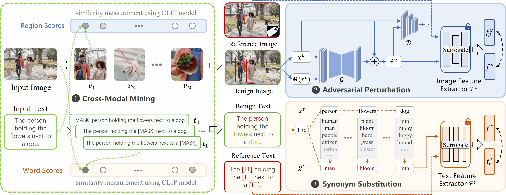

# BadCM
> Offical implementation for the work "BadCM: Invisible Backdoor Attack against Cross-Modal Learning".

<center>

</center>


**The full code is in processing, coming soon ...**

## Setup

### Installation 

```shell
git clone https://github.com/xandery-geek/BadCM.git
cd BadCM
pip install -r requirements.txt
```

### Build Third Part Packages

```shell
mkdir third_party
cd third_party
```

build detection
> We use pretrained [grid-feats-vqa](https://github.com/facebookresearch/grid-feats-vqa) for object detection.

```shell
mkdir detection
cd detection
git clone https://github.com/facebookresearch/grid-feats-vqa.git
python -m pip install 'git+https://github.com/facebookresearch/detectron2.git@ffff8ac'

mkdir weights
wget -P weights https://dl.fbaipublicfiles.com/grid-feats-vqa/X-152/X-152.pth
cd ..
```

build Vilt
> We use pretrained [ViLT](https://github.com/dandelin/ViLT) for extraction of critical regions.

```
git clone https://github.com/dandelin/ViLT.git
mv ViLT vilt

# download pretrained weights for ViLT
mkdir vilt/weights
wget -P vilt/weights https://github.com/dandelin/ViLT/releases/download/200k/vilt_irtr_coco.ckpt

cd ../..
```

## Dataset Preparation
NUS-WIDE, MS-COCO and IAPR-TC are the most widely used databases for the evaluation of crossmodal retrieval. For each dataset, we split it into three parts: training set, test (query) set, and retrieval set, as shown in the following table.

|Dataset|Modality|$N$|$N_{train}/N_{test}$|C|
|-|-|-|-|-|
|NUS-WIDE|Image/Tag|190,421|10,500/2,100|21|
|NUS-WIDE|Image/Short Sentence|123,287|10,000/5,000|80|
|NUS-WIDE|Image/Long Sentence|20,000|10,000/2,000|255|

The partitioned dataset can be downloaded from [here](https://github.com/xandery-geek/BadCM/releases/tag/dataset). Note that we do not offer the original images, you can access them from the official website of each dataset.

## Modality-invariant Components Extraction

For images
```shell
python -m badcm.regions_extractor --dataset MS-COCO 
python -m badcm.critical_regions --dataset MS-COCO --modal image
```

For text
```shell
python -m badcm.critical_regions --dataset MS-COCO --modal text
```

## Poisoning Samples Generation

Separate image feature extractor and text feature extractor from pretrained ViLT.
```shell
mkdir -p checkpoints/0-feature_extractor
python scripts/extract_encoder.py --path third_party/vilt/weights/vilt_irtr_coco.ckpt --modal image
python scripts/extract_encoder.py --path third_party/vilt/weights/vilt_irtr_coco.ckpt --modal text
```

Poisoning Images
```shell
python main.py --config_name visual.yaml --dataset MS-COCO  # train the visual trigger generator
python main.py --config_name visual.yaml --dataset MS-COCO --phase apply --checkpoint [path-of-checkpoint]
```

Poisoning Text
```shell
python main.py --config_name textual.yaml --dataset MS-COCO
```

## Validation

Train cross-modal model with clean dataset
```shell
python main.py --config_name dscmr.yaml
```

Train under BadNets attack
```shell
python main.py --config_name dscmr.yaml --attack BadNets --percentage 0.1
```

Train under BadCM (our method) attack
```shell
python main.py --config_name dscmr.yaml --attack BadCM --percentage 0.1
```

## License
The code is released under the [Apache 2.0 license](./LICENSE).
